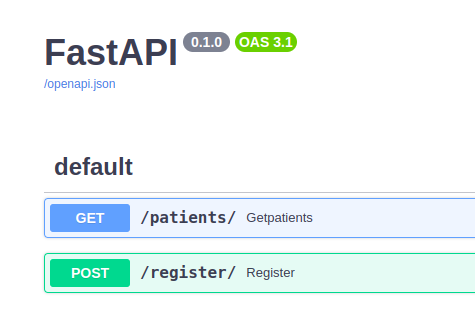
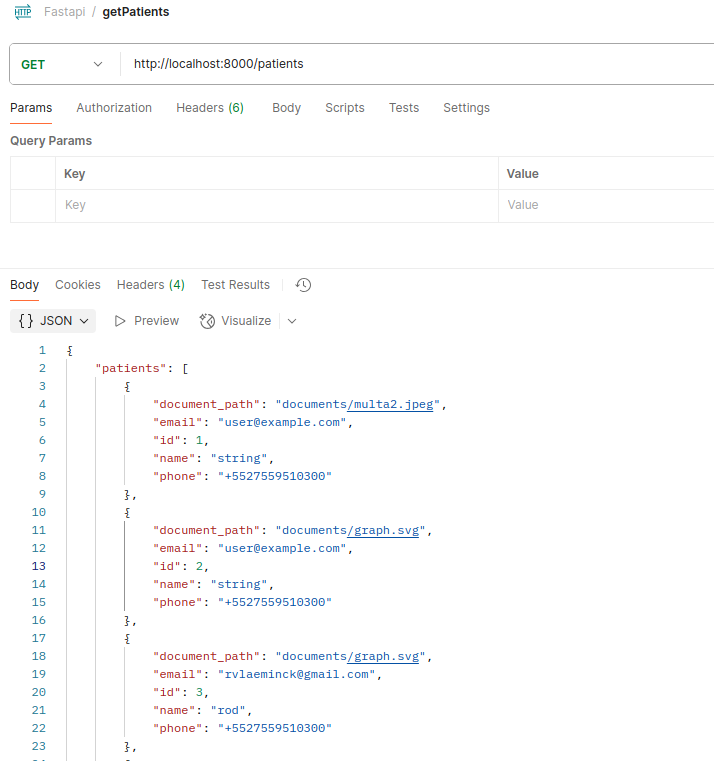
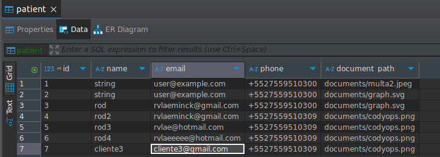

## Características
1. **Registro de pacientes**:
- POST
- Recopila el nombre del paciente, el correo electrónico, el número de teléfono y un archivo de documento.
- Valida los formatos de correo electrónico y teléfono.
- Aplica el límite de tamaño del documento (2 MB).

- GET
- Trae listado de pacientes registrados.
2. **Almacenamiento de base de datos**: almacenamiento seguro de datos de pacientes basado en MySQL.
3. **Notificaciones por correo electrónico asincrónicas**: envía correos electrónicos de confirmación tras un registro exitoso.
4. **Configuración dockerizada**: implementación simplificada mediante Docker Compose.

---

## Requerimientos
- **Docker**: 20.10+
- **Docker Compose**: 1.29+

---

## Instalación

### 1. Clonar el repo
```bash
git clone <repository-url>
```
### 2. .env
En el directorio raíz del proyecto, cree un archivo .env y agregue las credenciales del servidor de correo requeridas.
Puede consultar el archivo env-sample para conocer las variables necesarias.
Para realizar pruebas, puede utilizar un servicio como MailTrap.

### 3. Lanzar la aplicación

```bash
docker-compose up --build
```

## Acceso API

API url: `http://localhost:8000`. 

Endpoints: `http://localhost:8000/docs`. 



---

## API Endpoints

### 1. **Get Patients**
- **URL**: `/patients`
- **Method**: GET

### Responses

- **Success**: `200 OK`
  ```json
  {
    "patients": [
        {            
            "id": 1,
            "name": "John Doe",
            "phone": "+5527559510300",
            "document_path": "<base64-encoded-photo>",
            "email": "user@example.com"
        }, ....
    ]
  }

### 2. **Register Patient**
- **URL**: `/register`
- **Method**: POST
- **Payload**:
  ```json
  {
    "name": "John Doe",
    "email": "johndoe@example.com",
    "phone": "+1234567890",
    "document": "<base64-encoded-photo>"
  }
  
### Responses

- **Success**: `201 Created`
  ```json
  {
    "message": "Patient registered successfully."
  }
- **Validation Error**: `422 Unprocessable Entity`
  ```json
  {
    "detail": "**Validation Error detail**"
  }

- **Internal Server Error**: `500 Internal Server Error`
  ```json
  {
    "detail": "An error occurred during registration. Please try again later."
  }

---

## Acceder a la DB

### 1. **Vía Docker**

sudo docker ps
56cddad2ea9c   mysql:8.0  // copio ID

sudo docker exec -it 56cddad2ea9c mysql -u root -p

mysql> use mydb;

Database changed
mysql> show tables;
```bash
+----------------+
| Tables_in_mydb |
+----------------+
| patient        |
+----------------+
1 row in set (0.01 sec)
```

mysql> select * from patient;
```bash
+----+--------+----------------------+----------------+-----------------------+
| id | name   | email                | phone          | document_path         |
+----+--------+----------------------+----------------+-----------------------+
|  1 | string | user@example.com     | +5527559510300 | documents/multa2.jpeg |
|  2 | string | user@example.com     | +5527559510300 | documents/graph.svg   |
|  3 | rod    | rvlaeminck@gmail.com | +5527559510300 | documents/graph.svg   |
|  4 | rod2   | rvlaeminck@gmail.com | +5527559510309 | documents/codyops.png |
|  5 | rod3   | rvlae@hotmail.com    | +5527559510309 | documents/codyops.png |
+----+--------+----------------------+----------------+-----------------------+
5 rows in set (0.00 sec)
```

### 2. **Vía Postman**



### 3. **Vía DBeaver**


